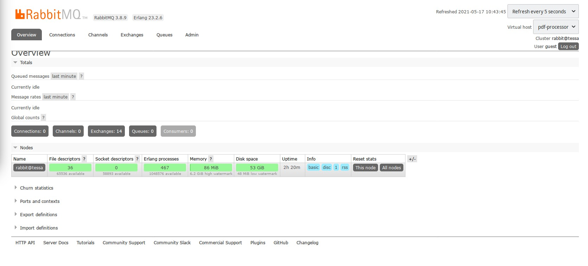

# pdf-processor
PDF processor using RabbitMQ

## Install RabbitMQ

On Debian Linux, execute the following command:

```bash
# apt-get install rabbitmq-server
# systemctl enable rabbitmq-server
# systemctl start rabbitmq-server
# systemctl status rabbitmq-server
```

The last command should show output similar to

```bash
● rabbitmq-server.service - RabbitMQ Messaging Server
     Loaded: loaded (/lib/systemd/system/rabbitmq-server.service; ena>
     Active: active (running) since Mon 2021-05-17 08:22:46 CEST; 5mi>
   Main PID: 7730 (beam.smp)
     Status: "Initialized"
      Tasks: 162 (limit: 19101)
     Memory: 88.0M
        CPU: 8.878s
     CGroup: /system.slice/rabbitmq-server.service
             ├─7730 /usr/lib/erlang/erts-11.1.8/bin/beam.smp -W w -K >
             ├─7941 erl_child_setup 65536
             ├─8015 inet_gethost 4
             └─8016 inet_gethost 4

May 17 08:22:42 tessa systemd[1]: Starting RabbitMQ Messaging Server.>
May 17 08:22:46 tessa systemd[1]: Started RabbitMQ Messaging Server.
```

## Install management plugin

RabbitMQ does not install a management console by default, but the optional web-based plugin makes it easy to peek into a running
RabbitMQ instance.

```bash
#  rabbitmq-plugins enable rabbitmq_management
```

Open the URL `http://localhost:15672/` with a browser. A login screen should now be shown:


The default user is *guest and the default password is also *guest*. After login in, the following screen is shown:


It is a good idea to change the password of the *guest* user:

```bash
# rabbitmqctl change_password guest new_password
```

## Configure vhost

```
# rabbitmqctl add_vhost pdf-processor
```

Refresh the web UI. It should now show the pdf-processor vhost:



## Add Pika package

[Pika](https://github.com/pika/pika) is a RabbitMQ library for Python.

### Configure virtual environment

To easily add packages with PyCharm without being super user, first configure a virtual environment. Open the settings dialog and select *Python Interpreter*:


Click on the gear icon and add a new Python virtual environment:


Now add the Pika package


